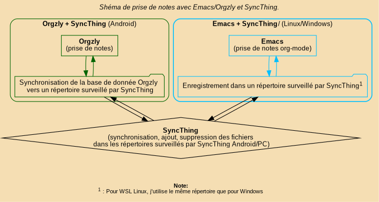

# Table of Contents

1.  [Présentation](#presentation)
2.  [Emacs pour Windows](#emacs-pour-windows)
    1.  [Installer Emacs pour Windows](#installer-emacs-pour-windows)
        1.  [cmd.exe](#org6298fb7)
        2.  [powershell](#orgc654e4d)
    2.  [Configurer Emacs](#configurer-emacs)
        1.  [Fichiers et répertoires à copier depuis le dépôt](#org4cb79d7)
        2.  [Configurer la variable HOME](#configurer-home)
        3.  [Ajouter %HOME%\\\bin au PATH](#ajouter-home-bin-au-path)
        4.  [Installer GPG](#installer-gpg)
        5.  [Générer une clé GPG](#generer-une-cle-gpg)
        6.  [Créer et chiffrer .authinfo](#creer-et-chiffrer-authinfo)
        7.  [Installer mplayer](#installer-mplayer)
        8.  [CMD](#org0c240c2)
        9.  [Fichiers à éditer](#fichiers-a-editer)
3.  [Prise de notes Orgzly Emacs-Pour-Windows](#org0a89f2a)
    1.  [Shéma de synnchronisation avec SyncThing](#org2055947)
    2.  [Orglzly](#org536f05e)
    3.  [Denote](#org4c0e446)
4.  [Notes de sécurité](#notes-de-securite)
5.  [](#org795aecd)


<a id="presentation"></a>

# Présentation

Configuration Emacs pour Windows et Linux. 


<a id="emacs-pour-windows"></a>

# Emacs pour Windows

-   Installer Emacs sous Windows
-   Répertoires et fichiers à copier
-   Configurer la variable d’environnement HOME
-   Ajouter HOME\bin au PATH
-   Installer et configurer GnuPG (GPG)
-   Créer et chiffrer un fichier .authinfo.gpg
-   Mplayer


<a id="installer-emacs-pour-windows"></a>

## Installer Emacs pour Windows

<https://www.gnu.org/software/emacs/download.html>

Vérifier l’installation dans cmd.exe / PowerShell :

    emacs --version

Si la commande n’est pas reconnue, ajouter Emacs au PATH :


<a id="org6298fb7"></a>

### cmd.exe

    setx PATH "%PATH%;C:\Program Files\Emacs\bin"


<a id="orgc654e4d"></a>

### powershell

    [Environment]::SetEnvironmentVariable("PATH", $env:PATH + ";C:\Program Files\Emacs\bin", [EnvironmentVariableTarget]::User)

Redémarrer le terminal.


<a id="configurer-emacs"></a>

## Configurer Emacs


<a id="org4cb79d7"></a>

### Fichiers et répertoires à copier depuis le dépôt

-   emacs.d/early-init.el
-   emacs.d/init.el
-   emacs.d/elisp/
-   emacs.d/config/
-   emacs.d/sons/
-   emacs.d/images/ (optionnel)

```
    HOME/
       ├── .authinfo.gpg
       ├── bin/
       ├── GNU/
       ├── .emacs.d/
              ├── early-init.el
              ├── init.el
              ├── config/
              ├── elisp/
              └── sons/
```

<a id="configurer-home"></a>

### Configurer la variable HOME

Définir HOME vers votre dossier utilisateur (persistant).

1.  cmd.exe

        setx HOME "%USERPROFILE%"
    
    Redémarrer le terminal.
    Vérifier :
    
        echo %HOME%

2.  PowerShell

        [Environment]::SetEnvironmentVariable("HOME", $Env:USERPROFILE, "User")
    
    Redémarrer le terminal.
    Vérifier :
    
        echo $Env:HOME


<a id="ajouter-home-bin-au-path"></a>

### Ajouter %HOME%\\\bin au PATH

Créer le dossier :

    mkdir %HOME%\bin

1.  cmd.exe

        setx PATH "%PATH%;%HOME%\bin"
    
    Redémarrer le terminal.
    Test du PATH
    
        echo %PATH%

2.  PowerShell

        [Environment]::SetEnvironmentVariable("Path", $Env:Path + ";" + "$Env:HOME\bin", "User")
    
    Redémarrer le terminal.
    Test du PATH
    
        $env:PATH


<a id="installer-gpg"></a>

### Installer GPG

Télécharger Gpg4win : <https://gpg4win.org/>
Vérifier l’installation :

    gpg --version


<a id="generer-une-cle-gpg"></a>

### Générer une clé GPG

    gpg --full-generate-key

Recommandations :

-   Type : RSA and RSA
-   Taille : 4096 bits
-   Phrase secrète forte

Lister les clés :

    gpg --list-secret-keys


<a id="creer-et-chiffrer-authinfo"></a>

### Créer et chiffrer .authinfo

*(Pour Gmail : créer un mot de passe d’application sur accounts.google.com si nécessaire.)*

Créer le fichier : %HOME%\\.authinfo
Exemple de contenu :

    machine smtp.gmail.com login utilisateur@gmail.com password motdepasse port 587
    machine imap.gmail.com login utilisateur@gmail.com password motdepasse port 993

Chiffrer le fichier (remplacez votre@email.com par votre UID GPG) :

    gpg -e -r votre@email.com .authinfo

Sécuriser .authinfo.gpp

    chmod 600 .authinfo.gpg

Supprimer le fichier en clair :

    del .authinfo

**Conserver uniquement : .authinfo.gpg**


<a id="installer-mplayer"></a>

### Installer mplayer

-   Télécharger le binaire mplayer pour Windows.
-   Installer dans %USERPROFILE%\bin ou %HOME%\bin.

Ajouter au PATH si nécessaire :


<a id="org0c240c2"></a>

### CMD

    setx PATH "%PATH%;%HOME%\bin"

Redémarrer le terminal.
²\*\*\* PowerShell

    [Environment]::SetEnvironmentVariable("Path", $Env:Path + ";" + "$Env:HOME\bin", "User")

Redémarrer le terminal.


<a id="fichiers-a-editer"></a>

### Fichiers à éditer

    - %HOME%/.authinfo
    - %HOME%/.emacs.d/config/emms_config.el
    - %HOME%/.emacs.d/config/gnus_conf.el
    - %HOME%/.emacs.d/config/email.el
    - %HOME%/.emacs.d/config/meteo.el (coordonnées GPS)

&#x2013;


<a id="org0a89f2a"></a>

# Prise de notes Orgzly Emacs-Pour-Windows

-   Orgzly

Emacs possède une version Android, mais sur un téléphone c'est un peu petit. J'ai donc choisi Orgzly pour la prise de notes rapide que je synchronise avec SyncThing.
<https://www.orgzly.com/>

-   Denote

<https://protesilaos.com/emacs/denote>
Outils Emacs pour la prise de notes et l'orginisation.

-   my-os est défini dans early-init.el


<a id="org2055947"></a>

## Shéma de synnchronisation avec SyncThing




<a id="org536f05e"></a>

## Orglzly

Télécharger:
<https://www.orgzly.com/>
La configuration se fait par l'interface


<a id="org4c0e446"></a>

## Denote

Manuel:
<https://protesilaos.com/emacs/denote>

Choix du répertoire de travail de Denote 

    (defvar my-denote-directory
      (expand-file-name
       (cond
        ;; Windows natif
        ((eq my-os 'windows)
         (expand-file-name "Documents/Denote" home-dir))
    
        ;; WSL Linux
        ((and (symbolp my-os)
              (string-prefix-p "wsl-" (symbol-name my-os)))
         (expand-file-name
          (format "/mnt/c/Users/%s/Documents/Denote"
                  my-windows-username)))
    
        ;; Linux natif
        ((eq my-os 'linux)
         (expand-file-name "Documents/Denote" home-dir))
    
        ;; fallback
        (t
         (expand-file-name "Documents/Denote" home-dir))))
      "Répertoire Denote selon OS.")


<a id="notes-de-securite"></a>

# Notes de sécurité

Ne jamais committer :

    - .authinfo
    - .authinfo.gpg
    - Clés privées GPG
    - Clés ivy-youtube dans emms_config
    - Les adresses mail dans gnus-conf.el et email.el
    
    Ajouter au .gitignore :
    
    *~
    *#
    #*
    /emacs.d/.emacs.d/elpa/
    /emacs.d/.emacs.d/eln-cache/
    /emacs.d/.emacs.d/emms/
    /emacs.d/.emacs.d/multisession/
    /emacs.d/.emacs.d/request/
    /emacs.d/.emacs.d/transient/
    /emacs.d/.emacs.d/elfeed_db/
    /emacs.d/.emacs.d/games/
    emacs.d/.emacs.d/request/
    
    authinfo/.authinfo
    authinfo/.authinfo.gpg
    
    emacs.d/.emacs.d/config/gnus-conf.el
    emacs.d/.emacs.d/donfig/email.el


<a id="org795aecd"></a>

# A FAIRE 

-   Configuration SyncThing, Denote, Orglzly.
-   Installation des Fonts.
-   Corfu.
-   Synchronisation Google Calendar avec le calendrier Emacs.
-   Import, Export des contacts.
-   Visiter Pompéi.

